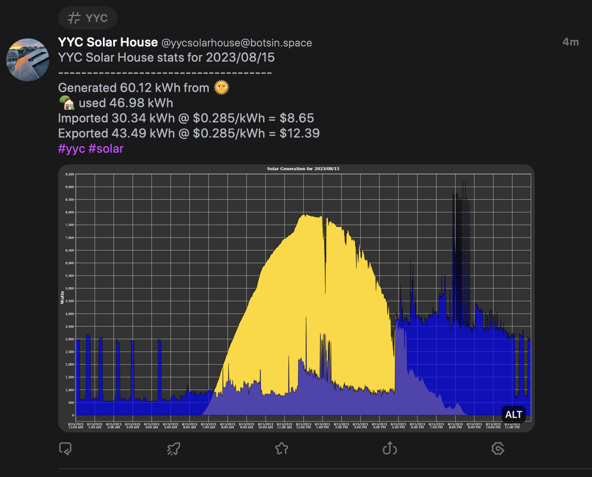

# emoncms-masto

This is a small bot for pulling feed data from [EmonCMS](https://emoncms.org/) and posting it to a Mastodon bot account;

Example status:


## Configuration
This app is configured via environment variables:
  * CULTURE - .NET culture name to use for numeric and currency formating
  * TZ - Set timezone within the container
  * BOT_NAME - Name of the bot to ouput in the mastodon status message
  * HASHTAGS - Additional hashtags to add to the status
  * EMONCMS_BASE_URI - Base url of your cloud or self hosted EmonCMS intall
  * EMONCMS_READ_API_KEY - Readonly API key for EmonCMS
  * EMONCMS_SOLAR_KWH_FEED_ID - Feed ID for solar generation kWh
  * EMONCMS_USE_KWH_FEED_ID - Feed ID for household usage kWh
  * EMONCMS_SOLAR_FEED_ID - Feed ID for solar generation
  * EMONCMS_USE_FEED_ID - Feed ID for household usage
  * EMONCMS_IMPORT_KWH_FEED_ID - Feed ID for import kWh
  * EMONCMS_EXPORT_KWH_FEED_ID - Feed ID for export kWh
  * RATE - Power rate in fractional dollars (ie 28.5¢/kWh would be configured as 0.285)
  * MASTODON_URI - URI for the mastodon instance (ie https://botsin.space)
  * MASTODON_API_KEY - API Key for API application [see below](#setting-up-mastodon-api-application)
  * PUBLISH - Set this to false to just output the post to STDOUT and bypass sending to mastodon, useful for testing

## Future development
* Make graphs/output more configurable
* Add hourly graphs/statistics

## Running/Developing
1. dotnet restore
2. dotnet build
3. set environment variables as per above (or create a appsettings.json)
4. dotnet run

## Setting up Mastodon API application
1. Login to your bot mastodon instance
2. Navigate to Edit Profile
3. Navigate to Development
4. Click New Application
5. Name application whatever you like
6. Give the application read, write:statuses, write:media scopes
7. Hit submit
8. Use the value from Your Access Token for MASTODON_API_KEY

## Running using docker
```
docker run \
   -it --rm \
   -e BOT_NAME="Test Bot" \
   -e HASHTAGS="#solar" \
   -e EMONCMS_BASE_URI=https://<emoncms host/ip>:port\
   -e EMONCMS_READ_API_KEY=<read api key> \
   -e EMONCMS_SOLAR_KWH_FEED_ID=<solar kwh feed id>\
   -e EMONCMS_USE_KWH_FEED_ID=<use kwh feed id> \
   -e EMONCMS_SOLAR_FEED_ID=<solar feed id>\
   -e EMONCMS_USE_FEED_ID=<use feed id> \
   -e EMONCMS_IMPORT_KWH_FEED_ID=<import feed id> \
   -e EMONCMS_EXPORT_KWH_FEED_ID=<export feed id> \
   -e RATE=<power rate> \
   -e MASTODON_URI=https://<mastodon host> \
   -e MASTODON_API_KEY=<mastodon app access token> \
   -n emoncms-masto \
   msroest/emoncms-masto
```
